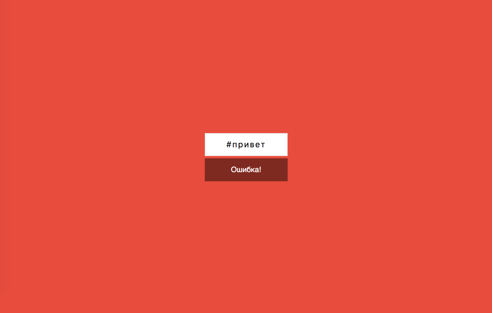
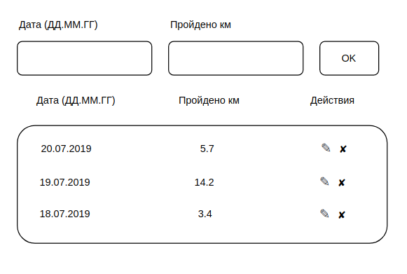

<a name="top"></a>
### [Gh-pages](https://mksinc.github.io/RA-hw.-4-Forms.-1-hex2rgb.-2-Steps.-3-Photo/)
# 4. Домашнее задание к лекции «Формы»

**Перейти к:**  
***[4.2 Учёт тренировок](#4.2)  
[4.3 Менеджер фото](#4.3)***

## 4.1 Конвертер цветов из HEX в RGB

Вам необходимо разработать конвертер цветов из HEX в RGB.


### Интерфейс конвертера

При правильном вводе цвета он показывает его представление в формате RGB и меняет цвет фона на заданный цвет:


Конвертер при вводе неправильного цвета в формате HEX должен сообщать об ошибке:


Необходимо дожидаться ввода всех 7-ми символов (включая решётку), чтобы принимать решение о том, показывать ошибку или менять цвет фона.


## <a name="4.2">4.2 Учёт тренировок</a>
***[(наверх)](#top)***

Вы решили реализовать небольшое приложение, которое хранит данные о тренировках (прогулках), которые вы совершаете в течение недели.

Общий интерфейс должен выглядеть следующим образом:



### Добавление данных

У вас должна быть форма ввода в которую вводится дата и количество пройденных километров. Добавленные значения добавляются в таблицу при отправке формы.

_Особенности добавления_:
1. Новые значения добавляются не в конец, а согласно сортировке по дате, т.е. если мы добавим 21.07.2019, то значение встанет на первую позицию (согласно скриншоту), а если 17.07.2019 - то на последнюю
2. Если мы добавляем значения, указывая уже существующую дату, то значения суммируются с теми, что хранятся в таблице, например, если добавить 20.07.2019 и 10км, то для даты 20.07.2019 будет отображаться 15.7км

### Удаление данных

С помощью иконки ✘ должна быть возможность удалить строку. Удаляется вся строка целиком и данные, связанные с ней.

### Редактирование данных

Дополнительное (не обязательное) задание: вы можете реализовать кнопку редактирования ✎ - при нажатии на которую происходит перенос данных в форму ввода с последующим сохранением (при нажатии кнопки Ok).


## <a name="4.3">4.3 Менеджер фото</a>
***[(наверх)](#top)***

Вы решили модернизировать один из старых проектов и переписать его в виде React-компонентов:


### Интерфейс Менеджера фото

При клике на области "Click to select" должно появляться стандартное окно выбора файлов операционной системы, в котором пользователь может выбрать один или несколько файлов изображений (image/*).

После выбора файлов они автоматически загружаются и отображаются в виде preview фиксированного размера (нижний блок). Для отображения используйте DataURL. Новый файлы должны добавляться (не заменять предыдущие).

При клике на крестик, изображение (и все связанные с ним данные) должны удаляться.

Важно: Drag & Drop реализовывать не нужно.

### Подсказки

1. Разместите с помощью CSS блок "Click to select" над `<input type="file" />` и установите этому блоку `pointer-events: none;`, чтобы вызывать окошко выбора файлов при клике.
1. Используйте следующую заготовку, для получения DataUrl:
```js
const fileToDataUrl = file => {
  return new Promise((resolve, reject) => {
    const fileReader = new FileReader();
  
    fileReader.addEventListener('load', evt => {
      resolve(evt.currentTarget.result);
    });
    
    fileReader.addEventListener('error', evt => {
      reject(new Error(evt.currentTarget.error));
    });
    
    fileReader.readAsDataURL(file);
  });
}

const handleSelect = async (evt) => {
    const files = [...evt.target.files];
    const urls = await Promise.all(files.map(o => fileToDataUrl(o)));
    // У вас в массиве - dataUrl, можете использовать в качестве значения атрибута src тега img
}
```
